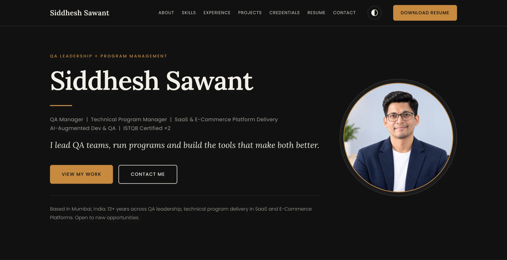

# Siddhesh Sawant — Portfolio

Personal portfolio site for Siddhesh Sawant — QA Lead / Program Manager based in Mumbai, India.



[](https://siddhesh-sawant.vercel.app)
[](https://nextjs.org)
[](https://www.typescriptlang.org)
[](https://tailwindcss.com)
[](https://vercel.com)

---

## Sections

| # | Section | Description |
|---|---------|-------------|
| 01 | **About** | Background, values, and approach |
| 02 | **Skills** | Technical and program management competencies |
| 03 | **Experience** | Parallel QA Leadership and Program Management timeline at Contentstack |
| 04 | **Work & Initiatives** | Selected projects with category filters (Program Management, AI-Assisted Engineering, QA & Testing) |
| 05 | **Credentials** | Certifications and education |
| 06 | **Resume** | Downloadable PDF and Word resume |
| 07 | **Contact** | Contact form + email, LinkedIn, GitHub |

---

## Tech Stack

- **Framework** — [Next.js 15](https://nextjs.org) (App Router, static export)
- **Language** — TypeScript
- **Styling** — Tailwind CSS v4 with CSS custom properties for theming
- **Fonts** — Lora (headings), system sans-serif (body), system monospace (code/links)
- **Hosting** — [Vercel](https://vercel.com)
- **Theme** — Dark / Light toggle, persisted in `localStorage`

---

## Local Development

```bash
npm install
npm run dev
```

Open [http://localhost:3000](http://localhost:3000).

Content lives in `/content` — each section has its own `.ts` file (e.g. `experience.ts`, `projects.ts`).

---

## Project Structure

```
├── app/              # Next.js App Router (layout, page, global CSS)
├── components/
│   ├── sections/     # One component per portfolio section
│   ├── Header.tsx
│   └── Footer.tsx
├── content/          # Section data (TypeScript, easy to edit)
└── public/           # Static assets
```

---

## Author

**Siddhesh Sawant** — [siddhesh-sawant.vercel.app](https://siddhesh-sawant.vercel.app) · [LinkedIn](https://in.linkedin.com/in/siddhesh-sawant-0283349) · [GitHub](https://github.com/siddheshsawant-work)
